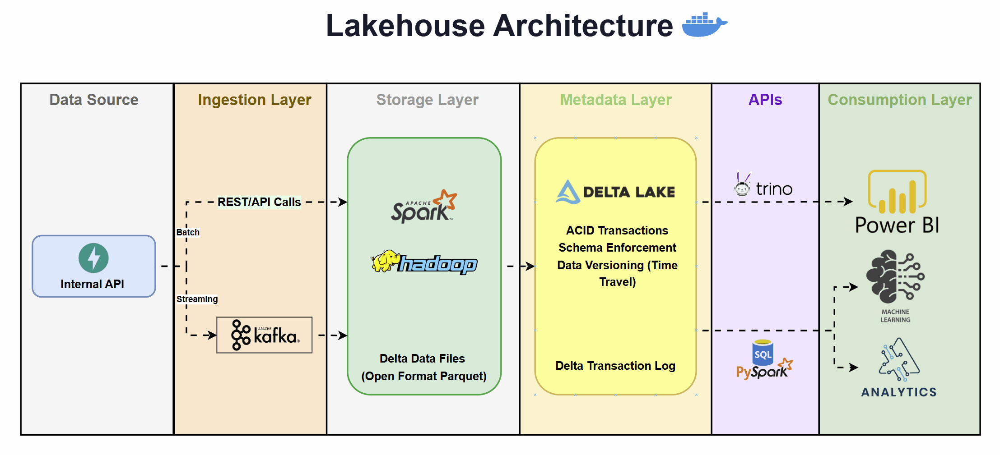
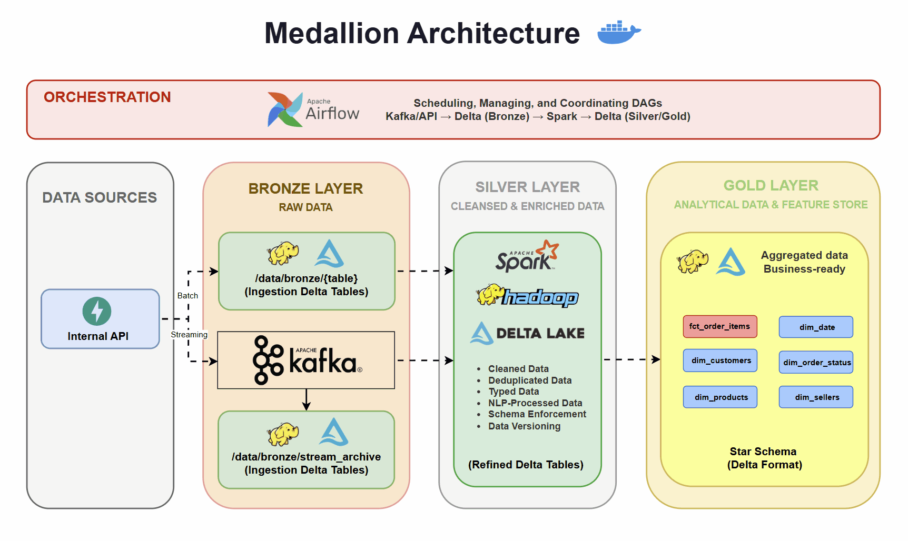

# Olist Medallion Data Lakehouse — Spark & Airflow

End-to-end Big Data pipeline for the [Brazilian E-Commerce Public Dataset by Olist](https://www.kaggle.com/datasets/olistbr/brazilian-ecommerce), built on the **Medallion Architecture** (Bronze → Silver → Gold) with real-time streaming simulation, **Delta Lake** table format, **PyDeequ** data quality checks, and orchestrated by Apache Airflow.

## Architecture Overview

### Lakehouse Architecture



### Medallion Architecture




### Architecture Blueprint

```
                          ┌─────────────┐
                          │  CSV Files   │
                          │  (9 tables)  │
                          └──────┬───────┘
                                 │ load
                                 ▼
                          ┌─────────────┐
                          │   SQLite +   │
                          │   FastAPI    │  ← Simulated Internal API
                          └──────┬───────┘
                                 │
                    ┌────────────┴────────────┐
                    │ 90% batch               │ 10% stream
                    ▼                         ▼
          ┌─────────────────┐       ┌─────────────────┐
          │  Spark Batch     │       │  Kafka Producer  │
          │  Ingest          │       │  (order_producer) │
          └────────┬────────┘       └────────┬─────────┘
                   │                          │
                   ▼                          ▼
     ┌──────────────────────────────────────────────────┐
     │         BRONZE LAYER (HDFS + Delta Lake)          │
     │  /data/bronze/{table}/          ← batch Delta    │
     │  /data/bronze/stream_archive/   ← Kafka Delta    │
     │  ✓ PyDeequ DQ checks on ingestion                │
     └──────────────────────┬───────────────────────────┘
                            │
                            ▼
     ┌──────────────────────────────────────────────────┐
     │         SILVER LAYER (HDFS + Delta Lake)          │
     │  • Deduplication & type casting                   │
     │  • Missing value imputation (median by zip)       │
     │  • NLP pipeline for Portuguese reviews            │
     │  ✓ PyDeequ DQ checks after cleaning               │
     └──────────────────────┬───────────────────────────┘
                            │
                            ▼
     ┌──────────────────────────────────────────────────────────┐
     │         GOLD LAYER (HDFS Delta + PostgreSQL)             │
     │  /data/gold/{dim/fct tables}/   ← Delta Lake files      │
     │  Star Schema in PostgreSQL:                               │
     │    dim_customers │ dim_sellers │ dim_products             │
     │    dim_order_status │ dim_date                            │
     │    fct_order_items (fact)                                 │
     │  ✓ PyDeequ DQ checks on star schema                      │
     └──────────────────────────────────────────────────────────┘
```

## Services

| Service | Image | Port | Role |
|---|---|---|---|
| `hadoop` | `apache/hadoop:3.3.6` | 19870, 19000 | HDFS storage (Bronze + Silver + Gold) |
| `postgres` | `postgres:16` | 5432 | Gold layer data warehouse |
| `zookeeper` | `confluentinc/cp-zookeeper:7.6.0` | 2181 | Kafka coordination |
| `kafka` | `confluentinc/cp-kafka:7.6.0` | 9092, 29092 | Real-time streaming |
| `spark-master` | custom `apache/spark:3.5.5` | 18080, 7077 | Spark cluster master |
| `spark-worker` | custom `apache/spark:3.5.5` | — | Spark executor |
| `airflow` | custom `apache/airflow:2.9` | 8082 | DAG orchestration |
| `api` | custom `python:3.12-slim` | 8000 | FastAPI + SQLite (simulated Olist API) |

## Project Structure

```
.
├── docker-compose.yml
├── config/
│   ├── hadoop/                          # HDFS, YARN configs
│   └── spark/
│       └── spark-defaults.conf          # Spark master, HDFS, Delta Lake, Kafka JARs
├── data/
│   └── brazilian-ecommerce/             # 9 raw CSV files
├── api/
│   ├── Dockerfile
│   ├── main.py                          # FastAPI endpoints
│   ├── init_db.py                       # CSV → SQLite loader
│   ├── database.py                      # SQLite connection
│   └── requirements.txt
├── kafka/
│   └── producer/
│       ├── order_producer.py            # Streams 10% orders to Kafka
│       └── requirements.txt
├── spark/
│   ├── Dockerfile                       # Apache Spark + JDBC + Kafka + Delta + PyDeequ
│   └── jobs/
│       ├── schemas.py                   # Explicit Bronze schema definitions
│       ├── data_quality.py              # PyDeequ DQ checks (Bronze, Silver, Gold)
│       ├── bronze_ingest.py             # API → HDFS Bronze (batch 90%) + DQ
│       ├── bronze_stream_archive.py     # Kafka → HDFS Bronze (stream archive)
│       ├── silver_clean.py             # Bronze → Silver (cleanse + NLP) + DQ
│       ├── gold_load.py                # Silver → HDFS Gold (Delta) → PostgreSQL + DQ
│       └── time_travel_examples.py     # Delta Lake time travel & versioning demo
├── airflow/
│   ├── Dockerfile
│   └── dags/
│       ├── olist_pipeline.py           # Main orchestration DAG
│       └── scripts/
│           └── order_producer.py       # Copy of Kafka producer for Airflow
├── sql/
│   ├── gold_schema.sql                 # Star schema DDL
│   └── init_airflow_db.sql             # Airflow metadata DB
└── scripts/
    └── bronze_to_gold_star_schema.py   # Pandas prototype (reference)
```

## Pipeline Components

### 1. Simulated Internal API (`api/`)

Loads all 9 Olist CSVs into a SQLite database and exposes them as REST endpoints, simulating Olist's internal production API that downstream systems pull data from.

**Endpoints:**

| Method | Path | Description |
|---|---|---|
| GET | `/api/v1/health` | Database connectivity check |
| GET | `/api/v1/tables` | List all tables with row counts |
| GET | `/api/v1/{table_name}?page=&size=` | Paginated table rows |
| GET | `/api/v1/{table_name}/{pk_value}` | Single row by primary key |
| GET | `/api/v1/orders/date-range?start=&end=` | Orders filtered by date range |

### 2. Bronze Layer — Batch + Stream Ingestion

**Data split strategy:** Orders are sorted chronologically by `order_purchase_timestamp`:
- **90%** → batch loaded from FastAPI to HDFS `/data/bronze/` as Delta Lake
- **10%** → streamed to Kafka topics, then archived to HDFS `/data/bronze/stream_archive/` as Delta Lake

Reference tables (customers, products, sellers, etc.) are 100% batch loaded.

**Schema enforcement:** All Bronze tables use explicit `StructType` schemas defined in `schemas.py` — all columns are `StringType` in Bronze (raw layer preserves source types). Silver layer handles type casting.

**Kafka topics:**
- `ecommerce.orders.live` — order events with `customer_id` as message key
- `ecommerce.logistics.updates` — delivery tracking events

**Stream archive (`bronze_stream_archive.py`):** A Spark Structured Streaming job that continuously reads Kafka events and writes them to HDFS Delta Lake with checkpointing for exactly-once semantics. This ensures Bronze layer immutability — events are permanently archived before Kafka's retention policy purges them.

**HDFS Bronze structure:**
```
/data/bronze/
├── olist_orders_dataset/              ← batch (90%)
├── olist_order_items_dataset/         ← batch (100%)
├── olist_customers_dataset/           ← batch (100%)
├── olist_order_payments_dataset/      ← batch (100%)
├── olist_order_reviews_dataset/       ← batch (100%)
├── olist_products_dataset/            ← batch (100%)
├── olist_sellers_dataset/             ← batch (100%)
├── olist_geolocation_dataset/         ← batch (100%)
├── product_category_name_translation/ ← batch (100%)
└── stream_archive/                    ← immutable Kafka event archive
    ├── ecommerce.orders.live/         ← Delta from order events
    ├── ecommerce.logistics.updates/   ← Delta from logistics events
    └── _checkpoints/                  ← Spark streaming checkpoints
```

### 3. Silver Layer — PySpark ETL

Reads Bronze Delta tables (batch + stream archive), applies transformations, writes Delta Lake to HDFS `/data/silver/`.

**Transformations:**

| Step | Description |
|---|---|
| **Merge & Deduplicate** | Union batch orders (90%) with stream archive orders (10%), drop duplicate `order_id` rows |
| **Type Casting** | Timestamps → `TimestampType`, financial values → `DoubleType` |
| **Missing Value Imputation** | Null `order_delivered_customer_date` → imputed using median delivery time per `customer_zip_code_prefix` (PySpark Window functions) |
| **Null Filling** | `review_score` nulls → 3 (neutral), `product_category_name` nulls → `"unknown"` |
| **NLP Pipeline** | Portuguese review text cleaning: lowercase → HTML tag removal → regex character normalization (preserving accented chars) → Portuguese stopword removal (200+ words) → whitespace normalization |
| **Computed Columns** | `product_volume_cm3` = length × width × height |

### 4. Gold Layer — HDFS Delta Lake + PostgreSQL Star Schema

Reads Silver Delta from HDFS, builds star schema tables, writes Delta Lake to HDFS `/data/gold/`, then loads into PostgreSQL.

**HDFS Gold structure:**
```
/data/gold/
├── dim_customers/
├── dim_sellers/
├── dim_products/
├── dim_order_status/
├── dim_date/
└── fct_order_items/
```

**Fact table:** `fct_order_items` (order-item granularity)

| Column | Type | Description |
|---|---|---|
| `order_item_key` | SERIAL PK | Surrogate key |
| `order_id` | VARCHAR(50) | Natural key from Olist |
| `customer_key` | INT FK | → `dim_customers` |
| `product_key` | INT FK | → `dim_products` |
| `seller_key` | INT FK | → `dim_sellers` |
| `order_date_key` | INT FK | → `dim_date` (YYYYMMDD format) |
| `estimated_delivery_date_key` | INT FK | → `dim_date` (estimated delivery date) |
| `delivered_date_key` | INT FK | → `dim_date` (actual customer delivery date) |
| `status_key` | INT FK | → `dim_order_status` |
| `item_price` | NUMERIC(10,2) | Product price |
| `freight_value` | NUMERIC(10,2) | Shipping cost |
| `review_score` | INT | Customer rating (1-5, null→3) |
| `processing_time_hours` | NUMERIC(10,2) | Approved → carrier handoff (hours) |
| `shipping_time_days` | INT | Carrier → customer delivery (days) |

**Dimension tables:**

| Table | Key | Attributes |
|---|---|---|
| `dim_customers` | `customer_key` | `customer_id`, `customer_unique_id`, zip, city, state |
| `dim_sellers` | `seller_key` | `seller_id`, zip, city, state |
| `dim_products` | `product_key` | `product_id`, `product_category_english`, weight, length, volume_cm3 |
| `dim_order_status` | `status_key` | `status_name` (delivered, shipped, canceled, etc.) |
| `dim_date` | `date_key` (YYYYMMDD) | `full_date`, `day_of_week`, `month_name`, `quarter`, `year`, `is_holiday_brazil` |

### 5. Data Quality — PyDeequ

Automated data quality checks run at each layer transition using [PyDeequ](https://github.com/awslabs/python-deequ):

| Layer | Checks |
|---|---|
| **Bronze** | `order_id` completeness + uniqueness, `customer_id` completeness, `product_id` completeness |
| **Silver** | `order_id` completeness + uniqueness, `review_score` range [1-5], `price` non-negative |
| **Gold** | `order_item_key` completeness + uniqueness, FK completeness, `item_price` & `freight_value` non-negative, `customer_key` uniqueness |

If any critical check fails, the pipeline halts with an exception.

### 6. Delta Lake Features

All data across Bronze, Silver, and Gold layers is stored in **Delta Lake** format, providing:

- **ACID transactions** on HDFS — safe concurrent reads/writes
- **Schema enforcement** — reject writes with incompatible schemas
- **Time travel** — query historical versions via `versionAsOf` / `timestampAsOf`
- **Incremental processing** — `delta` streaming reads for downstream consumers
- **Data versioning** — full commit history for audit and rollback

See `spark/jobs/time_travel_examples.py` for a demo of version querying and history inspection.

### 7. Airflow DAG

```
init_api ──► bronze_batch_ingest ──► silver_clean ──► gold_load
                   │
                   ▼
             kafka_producer ──► bronze_stream_archive ──► silver_clean
```

| Task | Operator | Job |
|---|---|---|
| `init_api` | PythonOperator | Health check FastAPI |
| `bronze_batch_ingest` | BashOperator (spark-submit) | `bronze_ingest.py` + DQ checks |
| `kafka_producer` | BashOperator | `order_producer.py` |
| `bronze_stream_archive` | BashOperator (spark-submit) | `bronze_stream_archive.py` (120s window) |
| `silver_clean` | BashOperator (spark-submit) | `silver_clean.py` + DQ checks |
| `gold_load` | BashOperator (spark-submit) | `gold_load.py` + DQ checks |

## Quick Start

```bash
# Build and start all services
docker compose up --build -d

# Wait for services to be healthy (~60s)
docker compose ps

# Verify the API
curl http://localhost:8000/api/v1/tables

# Verify HDFS Bronze directories
docker exec olist-hadoop hdfs dfs -ls /data/bronze/

# Verify HDFS Gold directories (after pipeline run)
docker exec olist-hadoop hdfs dfs -ls /data/gold/

# Verify PostgreSQL Gold tables
docker exec olist-postgres psql -U olist -d olist_dw -c "\dt"

# Query the fact table
docker exec olist-postgres psql -U olist -d olist_dw -c "SELECT COUNT(*) FROM fct_order_items;"
```

### Accessing UIs

| Service | URL | Credentials |
|---|---|---|
| Hadoop NameNode | http://localhost:19870 | — |
| Spark Master | http://localhost:18080 | — |
| Airflow | http://localhost:8082 | admin / admin |
| FastAPI Docs | http://localhost:8000/docs | — |

### Triggering the Pipeline Manually

1. Open Airflow at http://localhost:8082
2. Enable the `olist_medallion_pipeline` DAG
3. Click **Trigger DAG**

Or via CLI:
```bash
docker exec olist-airflow airflow dags trigger olist_medallion_pipeline
```

### Running Individual Spark Jobs

```bash
# Bronze batch ingest
docker exec olist-spark-master spark-submit \
  --master spark://spark-master:7077 \
  --conf spark.hadoop.fs.defaultFS=hdfs://namenode:9000 \
  --conf spark.hadoop.dfs.client.use.datanode.hostname=true \
  --conf spark.sql.extensions=io.delta.sql.DeltaSparkSessionExtension \
  --conf spark.sql.catalog.spark_catalog=org.apache.spark.sql.delta.catalog.DeltaCatalog \
  /opt/spark/jobs/bronze_ingest.py

# Silver ETL
docker exec olist-spark-master spark-submit \
  --master spark://spark-master:7077 \
  --conf spark.hadoop.fs.defaultFS=hdfs://namenode:9000 \
  --conf spark.hadoop.dfs.client.use.datanode.hostname=true \
  --conf spark.sql.extensions=io.delta.sql.DeltaSparkSessionExtension \
  --conf spark.sql.catalog.spark_catalog=org.apache.spark.sql.delta.catalog.DeltaCatalog \
  /opt/spark/jobs/silver_clean.py

# Gold load
docker exec olist-spark-master spark-submit \
  --master spark://spark-master:7077 \
  --conf spark.hadoop.fs.defaultFS=hdfs://namenode:9000 \
  --conf spark.hadoop.dfs.client.use.datanode.hostname=true \
  --conf spark.sql.extensions=io.delta.sql.DeltaSparkSessionExtension \
  --conf spark.sql.catalog.spark_catalog=org.apache.spark.sql.delta.catalog.DeltaCatalog \
  --conf spark.jars=/opt/spark/jars/postgresql-42.7.3.jar \
  /opt/spark/jobs/gold_load.py
```

## Data Quality Notes

The Olist dataset has known issues handled by the Silver ETL:

| Issue | Handling |
|---|---|
| UTF-8 BOM in `product_category_name_translation` | Read with `encoding="utf-8-sig"` |
| Inconsistent CSV quoting | Robust CSV parser (PySpark `inferSchema`) |
| 2,965 null delivery dates in orders | Imputed using median by zip code prefix |
| 89K null review comments | NLP only processes non-null text; nulls preserved |
| 610 products with null category | Filled with `"unknown"` |
| Commas inside review comment fields | Proper CSV parsing handles quoted fields |

## Tech Stack

- **Storage:** Hadoop HDFS + Delta Lake (Bronze/Silver/Gold), PostgreSQL (Gold), SQLite (API)
- **Processing:** Apache Spark 3.5 (PySpark)
- **Streaming:** Apache Kafka 7.6, Spark Structured Streaming
- **Data Quality:** PyDeequ
- **Orchestration:** Apache Airflow 2.9
- **API:** FastAPI, Uvicorn
- **Infrastructure:** Docker Compose

## License

MIT
